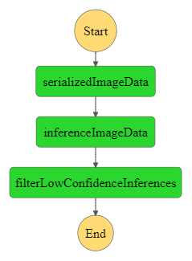
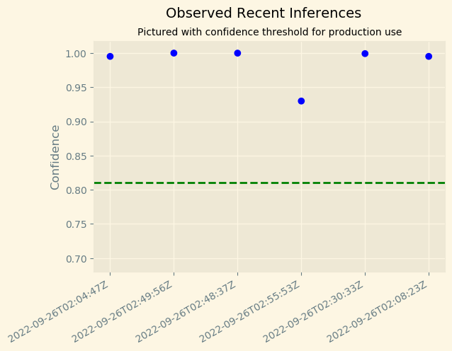
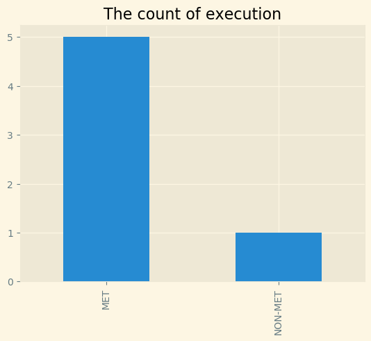

# Deploy and monitor a machine learning workflow for Image Classification

## Project Introduction

## Background

Image Classifiers are used in the field of computer vision to identify the content of an image and it is used across a broad variety of industries, from advanced technologies like autonomous vehicles and augmented reality, to eCommerce platforms, and even in diagnostic medicine.

You are hired as a Machine Learning Engineer for a scone-delivery-focused logistics company, *Scones Unlimited*, and you’re working to ship an Image Classification model. The image classification model can help the team in a variety of ways in their operating environment: detecting people and vehicles in video feeds from roadways, better support routing for their engagement on social media, detecting defects in their scones, and many more!

In this project, you'll be building an **image classification model** that can automatically detect *which kind of vehicle delivery drivers have*, in order to route them to the correct loading bay and orders. Assigning delivery professionals who have a bicycle to nearby orders and giving motorcyclists orders that are farther can help Scones Unlimited optimize their operations.

As an MLE, your goal is to ship a **scalable and safe** model. Once your model becomes available to other teams on-demand, it’s important that your model **can scale to meet demand**, and that **safeguards are in place to monitor and control** for drift or degraded performance.

In this project, you’ll use AWS Sagemaker to build an **image classification model** that can *tell bicycles apart from motorcycles*. You'll deploy your model, use AWS Lambda functions to build supporting services, and AWS Step Functions to compose your model and services into an event-driven application. At the end of this project, you will have created a portfolio-ready demo that showcases your ability to build and compose scalable, ML-enabled, AWS applications.

## Project Steps Overview

- Step 1: Data staging
- Step 2: Model training and deployment
- Step 3: Lambdas and step function workflow
- Step 4: Testing and evaluation
- Step 5: Optional challenge
- Step 6: Cleanup cloud resources

# Project Environment

- AWS Sagemaker Services

- AWS Lambda Functions

- AWS Step Function Visual Editor

  

## Project Architecture

We used a sample dataset called CIFAR to simulate the challenges Scones Unlimited are facing in Image Classification. We used a built-in Amazon SageMaker image classification algorithm for training and deploying and then used Amazon Step Function to chain three Lambda functions which was responsible for the image serialization, inference and filtering low-confidence results to automate the image classification workflow. At last part,  we  performed several step function invokations using data from the test dataset and used the captured data from SageMaker Model Monitor to create a visualization to monitor the model.

​																						Fig 1. Stepfunctions_Architecture

## Main Files

`starter.ipynb`: The notebook to complete the project.

`lambda.py`: The scripts including all the three Lambda function.

`my-source-package/`: A package for Lambda `inferenceImageData`([reference link](https://docs.aws.amazon.com/lambda/latest/dg/python-package-create.html#python-package-create-with-dependency))

`captured_data/`: The captured data used the captured data from SageMaker Model Monitor to create a visualization to monitor the model.

## Visualization

​																					Fig 2. Observed Recent Inferences

​																					Fig 3. The count of execution